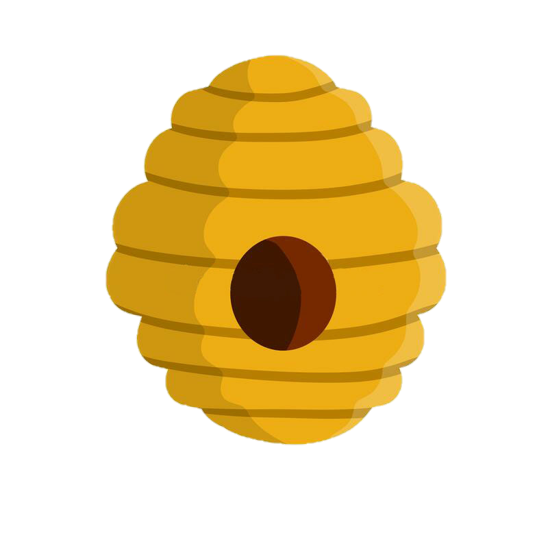
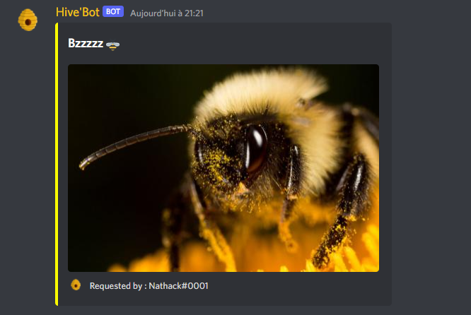

 

  

  <h3 align="center">Hive'Bot</h3>

  

Le bot permet "juste pour l'instant" de généré aléatoirement via une API un image d'abeille.
    
 

## 📷 Images 

  

## ⚙️ How-To setup 

 
 ## 📚 Fonctions utiles 

